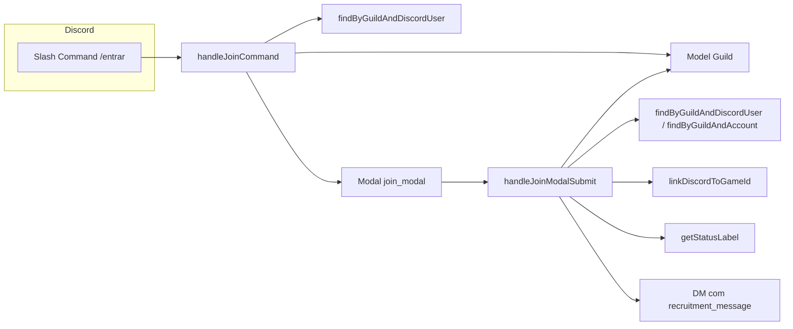
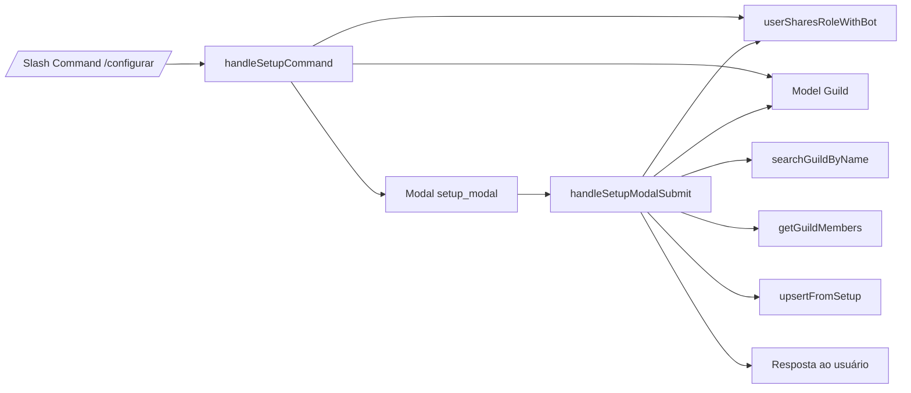
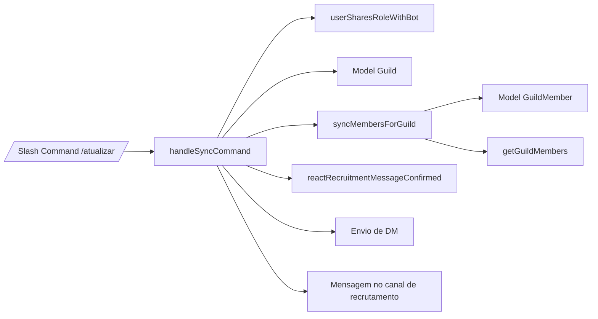
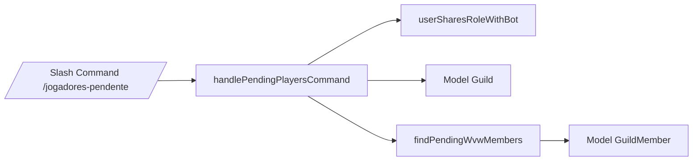
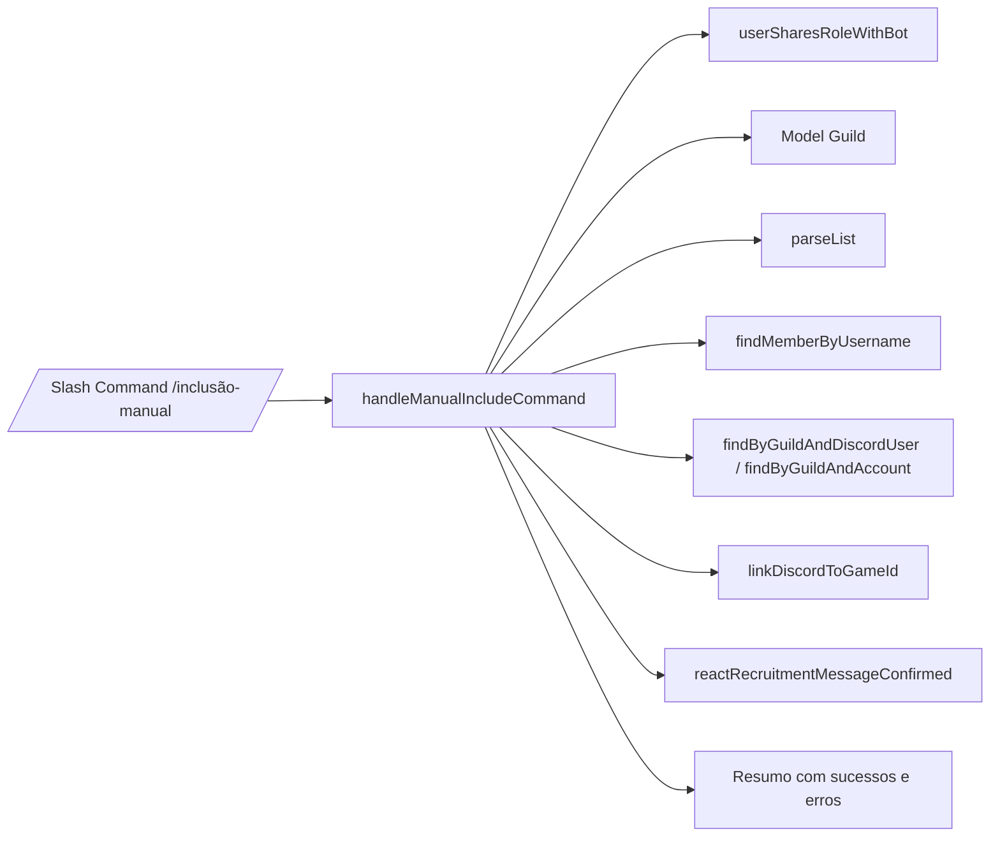

## Comandos Slash

Este documento descreve os comandos slash registrados em `deploy-commands.ts`, suas regras de uso e o fluxo de dados interno.

Comandos:
- `/entrar` (`commands/join.ts`)
- `/configurar` (`commands/setup.ts`)
- `/atualizar` (`commands/sync.ts`)
- `/jogadores-pendente` (`commands/pendingPlayers.ts`)
- `/inclusão-manual` (`commands/manualInclude.ts`)

---

### `/entrar` — Vincular ID de jogo (Guild Wars 2)

- **Arquivo**: `src/commands/join.ts`
- **Builder**: `joinCommand`
- **Handler de comando**: `handleJoinCommand`
- **Handler de modal**: `handleJoinModalSubmit`

**Objetivo**  
Permite que o usuário informe ou atualize seu ID de jogo (`account_id` do Guild Wars 2) para a guilda configurada no servidor.

**Regras de uso**
- Só pode ser usado **em servidor** (não funciona em DMs).
- O servidor precisa ter uma **guilda configurada** (`Guild` existente para `discord_server_id`).
- O usuário precisa ter **pelo menos uma das roles** definidas em `Guild.notification_roles`.

**Fluxo `/entrar`**
1. `handleJoinCommand` verifica se:
   - `interaction.guildId` existe.
   - Há um documento `Guild` para este servidor.
   - O membro possui alguma das roles em `notification_roles`.
2. Consulta `findByGuildAndDiscordUser(guild_id, interaction.user.id)` para obter o `account_id` já vinculado (se existir).
3. Abre um modal `join_modal` com:
   - Campo de texto `join_game_id` (ID de jogo), preenchido com o valor atual se existir.
4. Ao enviar o modal:
   - `handleJoinModalSubmit` valida novamente servidor/guilda/roles.
   - Verifica:
     - Se o usuário já está vinculado a outro `account_id` → retorna erro.
     - Se o `account_id` já está vinculado a outro usuário → erro.
     - Se o `account_id` já está com status `CONFIRMED` → erro.
   - Chama `linkDiscordToGameId` (service) para aplicar as regras de status.
   - Se o status resultante for `CONFIRMED` e houver `Guild.recruitment_message.content`, envia essa mensagem por DM ao usuário.
   - Responde ao modal com mensagem efêmera, incluindo o `status` formatado via `getStatusLabel`.

**Relações (Mermaid)**

---

### `/configurar` — Configurar guilda e API key

- **Arquivo**: `src/commands/setup.ts`
- **Builder**: `setupCommand`
- **Handlers**:
  - `handleSetupCommand` (slash)
  - `handleSetupModalSubmit` (modal `setup_modal`)
  - `handleSetupSelectMenu` (select menus do modal)

**Objetivo**  
Configurar ou atualizar a guilda GW2 associada ao servidor Discord, incluindo:
- Nome da guilda.
- Chave de API GW2.
- Canal de recrutamento (`recruitment_channel`).
- Canal de notificação (`notify_channel`).
- Roles de notificação (`notification_roles`).

**Regras de uso**
- Só pode ser usado **em servidor**.
- Usuário precisa compartilhar pelo menos uma **role com o bot** (`userSharesRoleWithBot`).
- Parâmetro obrigatório `guilda` (nome da guilda GW2).
- A API key pode ser:
  - Nova (primeira configuração).
  - Deixada em branco para manter a existente em caso de update.

**Fluxo `/configurar`**
1. `handleSetupCommand`:
   - Gera uma chave de contexto (`guildId:userId`) para armazenar:
     - Nome da guilda (`pendingGuildName`).
   - Verifica permissão com `userSharesRoleWithBot`.
   - Salva `guilda` em `pendingGuildName`.
   - Busca `Guild` existente (se houver) para:
     - Pré-preencher dados no modal (API key mascarada, canais, roles).
   - Constrói modal com:
     - Input da API key.
     - Select de canal de recrutamento.
     - Select de canal de notificação.
     - Select de roles base (notificação).
   - Mostra o modal.
2. `handleSetupModalSubmit`:
   - Valida servidor/guild/perm.
   - Recupera `guildName` de `pendingGuildName`.
   - Lê:
     - API key.
     - Roles selecionadas.
     - Canais selecionados.
   - Se já existir `Guild` e API key vazia → reaproveita a antiga.
   - Usa `searchGuildByName` (service GW2 API) para obter `guild_id`.
   - Usa `getGuildMembers` (service GW2 members) para listar membros da guilda na API.
   - Faz `Guild.findOneAndUpdate` (`upsert`) salvando:
     - `guild_id`, `discord_server_id`, `name`, `api_key`
     - `recruitment_channel`, `notify_channel`, `notification_roles`
   - Para cada membro retornado pela API:
     - Chama `upsertFromSetup` (service `guildMemberService`) para popular `guild_members`.
   - Responde ao usuário com um resumo da configuração e quantidade de membros sincronizados.
3. `handleSetupSelectMenu`:
   - Mantém em memória (Map) as escolhas de canal e roles enquanto o modal está aberto.

**Relações (Mermaid)**

---

### `/atualizar` — Sincronizar membros da guilda

- **Arquivo**: `src/commands/sync.ts`
- **Builder**: `syncCommand`
- **Handler**: `handleSyncCommand`

**Objetivo**  
Sincronizar os membros da guilda GW2 associada ao servidor com a coleção `guild_members`, atualizando:
- Status (`PENDING_GUILD_DATA`, `PENDING_DISCORD_DATA`, `CONFIRMED`).
- Flags de WvW.
- Mensagens de recrutamento a confirmar.

**Regras de uso**
- Apenas em servidor.
- Usuário precisa compartilhar role com o bot (`userSharesRoleWithBot`).
- O servidor precisa ter `Guild` configurada.

**Fluxo `/atualizar`**
1. Valida servidor/guild/perm.
2. Busca `Guild` do servidor.
3. Chama `syncMembersForGuild(guild_id, api_key)` (service).
4. Se erro → responde com mensagem explicando o erro.
5. Se sucesso:
   - Para cada item em `recruitmentMessagesToConfirm`, chama `reactRecruitmentMessageConfirmed` para reagir com ✅ nas mensagens de recrutamento do canal.
   - Se houver `recruitment_message.content` e `confirmedWithoutRecruitmentDiscordUserIds`, envia DM para cada usuário com o texto de recrutamento.
   - Se houver `recruitment_channel` e `confirmedRecruitmentDiscordUserIds`, envia mensagem no canal de recrutamento mencionando os usuários confirmados com o conteúdo de recrutamento.
6. Responde ao comando com um resumo das contagens (pendentes/confirmados).

**Relações (Mermaid)**

---

### `/jogadores-pendente` — Listar jogadores sem WvW configurado

- **Arquivo**: `src/commands/pendingPlayers.ts`
- **Builder**: `pendingPlayersCommand`
- **Handler**: `handlePendingPlayersCommand`

**Objetivo**  
Listar jogadores que:
- Estão `CONFIRMED` na coleção `guild_members`.
- Não possuem `wvw_member = true`.
- Possuem pelo menos uma das roles em `Guild.notification_roles`.

**Regras de uso**
- Apenas em servidor.
- Usuário precisa compartilhar role com o bot (`userSharesRoleWithBot`).
- Servidor precisa ter `Guild` configurada.

**Fluxo `/jogadores-pendente`**
1. Valida servidor/guild/perm.
2. Busca `Guild` e extrai roles de notificação.
3. Chama `findPendingWvwMembers(guild_id, guildRoleIds)` (service).
4. Para cada membro retornado:
   - Resolve o nome de usuário do Discord (`globalName` ou `username`) para exibir junto com o `account_id`.
5. Monta uma lista textual respeitando limite de caracteres do Discord (faz chunk em múltiplas mensagens efêmeras, se necessário).

**Relações (Mermaid)**

---

### `/inclusão-manual` — Vincular usuários manualmente

- **Arquivo**: `src/commands/manualInclude.ts`
- **Builder**: `manualIncludeCommand`
- **Handler**: `handleManualIncludeCommand`

**Objetivo**  
Permitir que administradores vinculem vários usuários do Discord a IDs de jogo manualmente, em lote, no formato:

`usuario1=GameId.1234, usuario2=GameId.4321`

**Regras de uso**
- Apenas em servidor.
- Usuário precisa compartilhar role com o bot (`userSharesRoleWithBot`).
- Servidor precisa ter `Guild` configurada.
- IDs de jogo devem respeitar `GAME_ID_REGEX` (`Nome.1234`).

**Fluxo `/inclusão-manual`**
1. Lê a opção `lista` e chama `parseList` para obter pares `{ username, gameId }` válidos.
2. Se nenhum par válido → responde com mensagem de erro explicando o formato esperado.
3. Faz `interaction.deferReply` (efêmero) e garante que o cache de membros do servidor seja carregado.
4. Para cada par:
   - Usa `findMemberByUsername` para localizar o membro pelo `displayName` ou `username`.
   - Obtém roles do membro que pertencem à lista de `notification_roles`.
   - Verifica via `findByGuildAndDiscordUser` se já existe vínculo com outro `account_id`.
   - Verifica via `findByGuildAndAccount` se o `account_id` já está `CONFIRMED`.
   - Se tudo certo, chama `linkDiscordToGameId` com as roles calculadas.
   - Se o resultado for `CONFIRMED` e o membro tiver `recruitment_message_id`/`recruitment_channel_id`, chama `reactRecruitmentMessageConfirmed` para reagir com ✅.
5. Monta um resumo com:
   - Lista de inclusões bem-sucedidas (mostrando `username → gameId` e status).
   - Lista de erros para cada entrada (usuário não encontrado, já vinculado a outro ID, etc.).

**Relações (Mermaid)**

