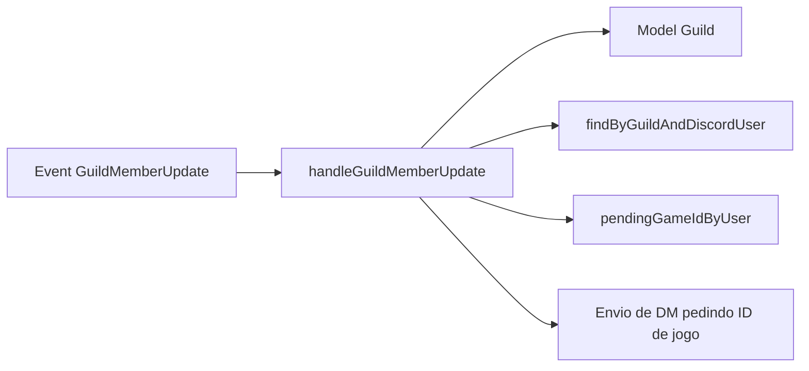
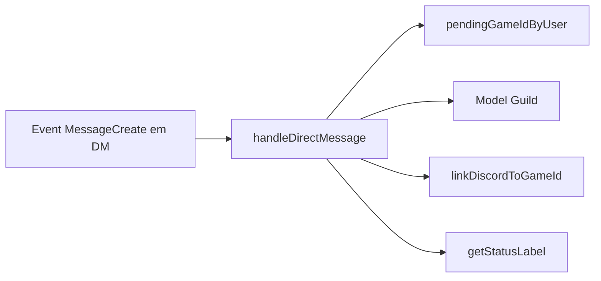
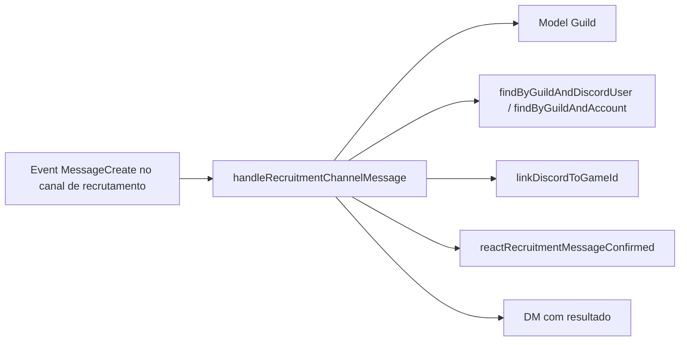
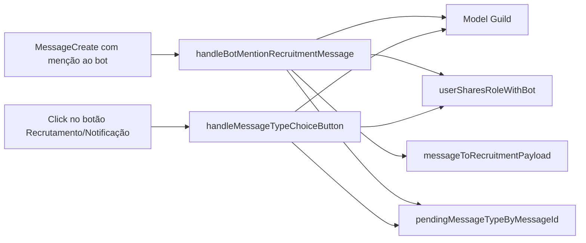

## Eventos

Este documento descreve os handlers de eventos do Discord usados pelo bot.

Eventos principais:
- `GuildMemberUpdate` → `handleGuildMemberUpdate`
- `MessageCreate` (DMs, canal de recrutamento, menções ao bot) → `handleDirectMessage`, `handleRecruitmentChannelMessage`, `handleBotMentionRecruitmentMessage`, `handleMessageTypeChoiceButton`

---

### `GuildMemberUpdate` — `handleGuildMemberUpdate`

- **Arquivo**: `src/events/guildMemberUpdate.ts`
- **Registrado em**: `index.ts` (`client.on(Events.GuildMemberUpdate, handleGuildMemberUpdate)`)

**Objetivo**  
Detectar quando um membro recebe uma das roles configuradas em `Guild.notification_roles` e iniciar o fluxo de coleta do ID de jogo via DM.

**Fluxo**
1. Recebe `oldMember` e `newMember`.
2. Obtém `discordServerId` do `newMember.guild`.
3. Busca `Guild` pela `discord_server_id`.
4. Lê `notification_roles` e:
   - Se o array estiver vazio, encerra.
5. Usa `findByGuildAndDiscordUser` para verificar se já há um vínculo para este usuário:
   - Se já houver, não envia DM (já está vinculado).
6. Compara as roles do usuário antes e depois:
   - Encontra uma `roleId` em `notification_roles` que ele **não tinha** e **passou a ter**.
7. Se encontrou:
   - Cria DM com o usuário e envia mensagem pedindo o ID de jogo (`SeuNome.1234`).
   - Registra em `pendingGameIdByUser`:
     - `discordServerId`.
     - Roles atuais do membro.

**Relações (Mermaid)**

---

### `MessageCreate` — DMs (`handleDirectMessage`)

- **Arquivo**: `src/events/messageCreate.ts`
- **Registrado em**: `index.ts` (`client.on(Events.MessageCreate, handleDirectMessage, ...)`)

**Objetivo**  
Tratar respostas em DM de usuários que receberam a mensagem automática pedindo o ID de jogo.

**Fluxo**
1. Ignora mensagens de bot.
2. Verifica se:
   - Não é mensagem em servidor (`!message.guildId`).
   - O canal é DM (`message.channel.isDMBased()`).
3. Verifica se há pendência registrada em `pendingGameIdByUser` para o autor da mensagem:
   - Se não houver, ignora (não é uma resposta esperada).
4. Valida o conteúdo da mensagem com `GAME_ID_REGEX`:
   - Se inválido → responde instruindo o formato correto.
5. Busca `Guild` associada ao `discordServerId` dessa pendência.
6. Filtra roles do usuário que intersectam com `notification_roles`.
7. Chama `linkDiscordToGameId` com:
   - `guildId`, `accountId` (ID de jogo digitado), `discordUserId`, `roles`.
8. Remove a pendência de `pendingGameIdByUser`.
9. Responde ao usuário com o status (`getStatusLabel`).

**Relações (Mermaid)**

---

### `MessageCreate` — Canal de recrutamento (`handleRecruitmentChannelMessage`)

- **Arquivo**: `src/events/messageCreate.ts`
- **Objetivo**  
Permitir que um membro se registre informando o ID de jogo diretamente no canal de recrutamento configurado.

**Fluxo**
1. Ignora bots e mensagens fora de servidor.
2. Busca `Guild` para o `message.guildId`.
3. Verifica se:
   - `Guild.recruitment_channel` existe e é igual a `message.channelId`.
4. Procura um ID de jogo no conteúdo da mensagem usando `GAME_ID_REGEX`.
5. Resolve o membro no servidor e verifica roles de notificação.
6. Verifica regras de conflito:
   - Se já existe `discord_user` diferente com aquele `account_id` → envia DM avisando que o ID já está vinculado a outro usuário.
   - Se o `account_id` já está `CONFIRMED` → envia DM avisando que já está confirmado.
7. Se tudo certo:
   - Chama `linkDiscordToGameId` com:
     - `guildId`, `accountId`, `discordUserId`, `roles`, `recruitment_message_id`, `recruitment_channel_id`.
   - Se o status resultante for `CONFIRMED`:
     - Chama `reactRecruitmentMessageConfirmed` para reagir com ✅ na mensagem do canal.
   - Envia DM para o usuário com o status.
   - Caso DM falhe, envia mensagem de fallback no canal.

**Relações (Mermaid)**

---

### `MessageCreate` — Menção ao bot (recrutamento vs notificação)

- **Arquivo**: `src/events/messageCreate.ts`
- **Funções**:
  - `handleBotMentionRecruitmentMessage`
  - `handleMessageTypeChoiceButton`

**Objetivo**  
Permitir que um administrador classifique uma mensagem existente como:
- Mensagem de recrutamento (`Guild.recruitment_message`).
- Mensagem de notificação (`Guild.notification_message`).

**Fluxo `handleBotMentionRecruitmentMessage`**
1. Ignora bots e mensagens fora de servidor.
2. Verifica se o bot foi mencionado na mensagem.
3. Verifica se a mensagem é uma resposta (`message.reference.messageId`) a uma outra mensagem.
4. Busca `Guild` do servidor.
5. Verifica se o autor da mensagem compartilhada tem alguma role em comum com o bot (`userSharesRoleWithBot`).
6. Busca a mensagem sendo respondida.
7. Serializa essa mensagem em um `IRecruitmentMessagePayload` com:
   - `content`, `embeds`, `components`, `attachment_urls`.
8. Envia uma nova mensagem com dois botões:
   - **Recrutamento** (`MSG_TYPE_RECRUITMENT`).
   - **Notificação** (`MSG_TYPE_NOTIFICATION`).
9. Armazena em `pendingMessageTypeByMessageId`:
   - `discordServerId`, payload, `userId` do autor da ação.

**Fluxo `handleMessageTypeChoiceButton`**
1. Recebe `MessageComponentInteraction`.
2. Verifica se `customId` é um dos esperados (`MSG_TYPE_RECRUITMENT` ou `MSG_TYPE_NOTIFICATION`).
3. Busca pendência em `pendingMessageTypeByMessageId` pelo `interaction.message.id`.
4. Garante que a interação é do mesmo `userId` que iniciou a escolha.
5. Valida permissão via `userSharesRoleWithBot`.
6. Determina o campo a ser salvo:
   - `recruitment_message` ou `notification_message`.
7. Atualiza o documento `Guild` com o payload serializado.
8. Atualiza a mensagem do botão removendo os componentes e informando que foi salvo.

**Relações (Mermaid)**

