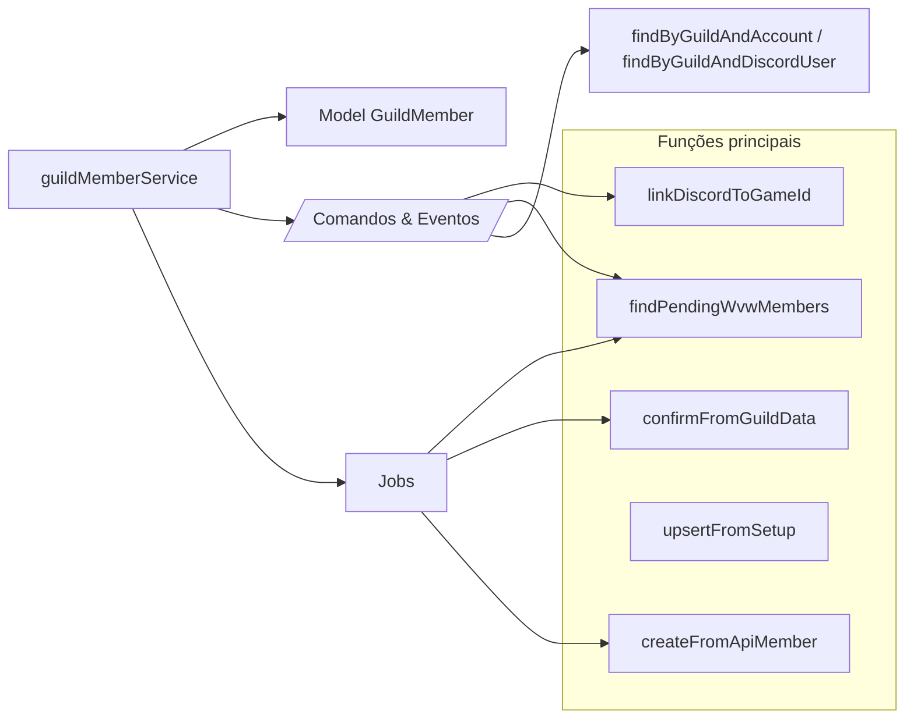
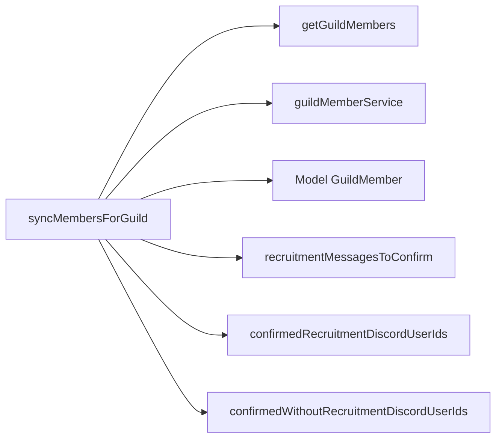

## Services

Os services encapsulam regras de negócio e integrações externas (APIs GW2, coleção `guild_members`) para que comandos, eventos e jobs usem uma interface consistente.

Services principais:
- `guildMemberService.ts`
- `gw2Api.ts`
- `gw2GuildMembers.ts`
- `syncGuildMembers.ts`

---

### `guildMemberService.ts`

**Responsabilidade**  
Centralizar todas as operações de negócio em cima da coleção `guild_members`, incluindo:
- Cálculo de status.
- Criação a partir da API.
- Atualização de status quando a API confirma presença na guilda.
- Busca e remoção de membros.

**Funções**

- **`computeStatusAfterLinkDiscord(existingMember)`**
  - Define o novo status ao vincular um usuário Discord a um `account_id`.
  - Regras:
    - Se `existingMember` não existir → `PENDING_GUILD_DATA`.
    - Se `existingMember.status === PENDING_DISCORD_DATA` → `CONFIRMED`.
    - Caso contrário → mantém `existingMember.status`.

- **`linkDiscordToGameId(params: LinkDiscordParams)`**
  - Parâmetros:
    - `guildId`, `accountId`, `discordUserId`, `roles`.
    - `recruitment_message_id?`, `recruitment_channel_id?`.
  - Fluxo:
    1. Busca membro atual pelo par `guild_id + account_id`.
    2. Calcula `status` via `computeStatusAfterLinkDiscord`.
    3. Monta `updatePayload` com:
       - `discord_user`, `status`, `roles`.
       - Opcionalmente `recruitment_message_id`, `recruitment_channel_id`.
    4. Executa `findOneAndUpdate` com `upsert` para criar/atualizar o documento.
    5. Retorna `{ updated, status }`.
  - Usado por:
    - `/entrar` (modal).
    - `/inclusão-manual`.
    - `handleDirectMessage` (DM).
    - `handleRecruitmentChannelMessage`.

- **`createFromApiMember(guildId, apiMember)`**
  - Cria um novo documento `GuildMember` a partir de um membro retornado pela API GW2.
  - Regras:
    - `account_id = apiMember.name`.
    - `status = PENDING_DISCORD_DATA`.
    - `joined_at` vem de `apiMember.joined` (ou `new Date()` se ausente).

- **`markAsPendingGuildData(guildId, accountId)`**
  - Marca um membro como `PENDING_GUILD_DATA` quando:
    - Ele saiu da guilda na API.
    - Ainda não foi confirmado pela API.
  - Também zera `joined_at`.

- **`confirmFromGuildData(guildId, accountId, joinedAt)`**
  - Atualiza membro de `PENDING_GUILD_DATA` para `CONFIRMED` quando a API de membros indica que ele está na guilda.
  - Retorna:
    - `channelId` e `messageId` se o membro tiver `recruitment_channel_id` e `recruitment_message_id`.
  - Permite que `syncMembersForGuild` reaja com ✅ nas mensagens de recrutamento.

- **`upsertFromSetup(guildId, apiMember)`**
  - Usado no `/configurar` na primeira configuração (ou atualizações) para popular a coleção `guild_members`.
  - Se já existir documento:
    - Atualiza dados da API (`wvw_member`, `joined_at`).
  - Se não existir:
    - Cria documento com `status = PENDING_DISCORD_DATA`.

- **`findPendingWvwMembers(guildId, guildRoleIds)`**
  - Retorna membros que:
    - `guild_id` igual.
    - `status = CONFIRMED`.
    - `wvw_member = false`.
    - `roles` contém pelo menos uma das `guildRoleIds`.
  - Usado por:
    - `/jogadores-pendente`.
    - Job `notify-wvw-members`.

- **`findByGuildAndAccount(guildId, accountId)`**
  - Busca membro pelo par `guild_id + account_id`.
  - Usado em diversas validações.

- **`findByGuildAndDiscordUser(guildId, discordUserId)`**
  - Busca membro pelo par `guild_id + discord_user`.
  - Usado para:
    - Verificar se um usuário já está vinculado a outro `account_id`.
    - Verificar se um usuário já está cadastrado antes de enviar DM.

- **`removeMember(guildId, accountId)`**
  - Remove um membro (exemplo: substituição de ID de jogo).

**Relações (Mermaid)**

---

### `gw2Api.ts`

**Responsabilidade**  
Encapsular a busca de uma guilda pelo nome na API pública do Guild Wars 2.

**Função**

- **`searchGuildByName(name: string): Promise<string | null>`**
  - Monta URL `https://api.guildwars2.com/v2/guild/search?name=...`.
  - Faz `fetch`.
  - Se a resposta não for `ok` ou não contiver um array, retorna `null`.
  - Caso contrário, retorna o primeiro elemento do array (o `guild_id`).
  - Usado no `/configurar` para traduzir o nome da guilda no jogo para um `guild_id` estável.

---

### `gw2GuildMembers.ts`

**Responsabilidade**  
Consultar a API GW2 para obter a lista de membros de uma guilda.

**Tipos**

- `Gw2GuildMember`:
  - `name`: `account_id` do jogador.
  - `rank`: rank dentro da guilda.
  - `joined`: string de data de entrada.
  - `wvw_member`: flag se o jogador marcou a guilda como WvW.

- `GuildMembersResult`:
  - `ok: true` + `members: Gw2GuildMember[]`.
  - ou `ok: false` + `error: string`.

**Função**

- **`getGuildMembers(guildId, accessToken)`**
  - Monta URL `https://api.guildwars2.com/v2/guild/{guildId}/members?access_token=...`.
  - Faz `fetch` e `res.json()`.
  - Caso especial:
    - Se a resposta for objeto com `text = "access restricted to guild leaders"` → `ok: false` com essa mensagem.
  - Se não vier array → `ok: false` com erro genérico.
  - Se vier array → `ok: true` com a lista convertida em `Gw2GuildMember[]`.

---

### `syncGuildMembers.ts`

**Responsabilidade**  
Sincronizar a coleção `guild_members` de uma guilda GW2 específica com o estado atual retornado pela API GW2.

**Tipos de resultado**

- **`SyncMembersResult`** (`ok: true`):
  - `pendingGuildDataCount`: quantos membros ficaram com dados da guilda pendentes (saíram da guilda ou não confirmados).
  - `pendingDiscordDataCount`: quantos membros novos na guilda GW2 não têm Discord vinculado ainda.
  - `confirmedCount`: quantos membros foram confirmados (passaram de `PENDING_GUILD_DATA` para `CONFIRMED`).
  - `recruitmentMessagesToConfirm`: lista de `{ channelId, messageId }` para reagir com ✅.
  - `confirmedRecruitmentDiscordUserIds`: usuários confirmados que têm mensagem de recrutamento associada (para menções em canal).
  - `confirmedWithoutRecruitmentDiscordUserIds`: usuários confirmados sem mensagem de recrutamento (para envio via DM).

- **`SyncMembersResult`** (`ok: false`):
  - `error`: texto de erro de API ou lógica.

**Fluxo `syncMembersForGuild(guildId, apiKey)`**
1. Chama `getGuildMembers(guildId, apiKey)`:
   - Se falhar → retorna `{ ok: false, error }`.
2. Carrega todos os `GuildMember` da guilda (`dbMembers`) e cria `Map` por `account_id`.
3. Cria `Map` dos membros da API (`apiMembers`) por `name`.
4. Para cada `apiMember`:
   - Se já existe em `dbMembersMap`:
     - Se `status === PENDING_GUILD_DATA`:
       - Chama `confirmFromGuildData` para marcar como `CONFIRMED` e atualizar `joined_at`.
       - Se o membro tiver `discord_user`:
         - Se `confirmResult` tiver `channelId`/`messageId`:
           - Adiciona em `recruitmentMessagesToConfirm` e `confirmedRecruitmentDiscordUserIds`.
         - Senão:
           - Adiciona em `confirmedWithoutRecruitmentDiscordUserIds`.
       - Incrementa `confirmedCount`.
     - Remove este `accountId` do `dbMembersMap` (já foi processado).
   - Se não existe em `dbMembersMap`:
     - Chama `createFromApiMember` para criar documento `PENDING_DISCORD_DATA`.
     - Incrementa `pendingDiscordDataCount`.
5. Após percorrer todos `apiMembers`:
   - Para cada `accountId` que sobrou em `dbMembersMap`:
     - Chama `markAsPendingGuildData` (o membro não está mais na guilda GW2).
     - Incrementa `pendingGuildDataCount`.
6. Retorna objeto `ok: true` com contagens e listas preenchidas.

**Uso**
- Comando `/atualizar` (para uma única `Guild` associada ao servidor).
- Job `sync-guild-members` (para todas as `Guild` cadastradas).

**Relações (Mermaid)**

