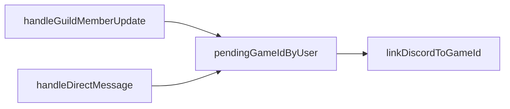

## Utils

As funções utilitárias fornecem comportamentos de apoio para os comandos, eventos e services.

Utils principais:
- `roleCheck.ts`
- `recruitmentMessage.ts`
- `pendingDm.ts`

---

### `roleCheck.ts` — `userSharesRoleWithBot`

**Função**

- **`userSharesRoleWithBot(guild, member)`**
  - Verifica se o membro compartilha **pelo menos uma role** com o bot no servidor.
  - Ignora a role `@everyone` (o próprio `guild.id`).
  - Suporta dois formatos de `member`:
    - `GuildMember` (objeto do Discord.js).
    - `{ roles: string[] }` (por exemplo, dados derivados ou da API).

**Regras**
- Se `guild` ou `member` forem nulos → retorna `false`.
- Se `guild.members.me` (membro do bot) não existir → `false`.
- Se o bot não tiver nenhuma role além de `@everyone` → `false`.
- Se houver interseção entre as roles do usuário e as do bot (excluindo `guild.id`) → `true`.

**Uso**
- Controle de permissão para:
  - `/configurar`
  - `/atualizar`
  - `/jogadores-pendente`
  - `/inclusão-manual`
  - `handleBotMentionRecruitmentMessage`
  - `handleMessageTypeChoiceButton`

---

### `recruitmentMessage.ts` — `reactRecruitmentMessageConfirmed`

**Função**

- **`reactRecruitmentMessageConfirmed(guild, channelId, messageId)`**
  - Busca o canal em `guild.channels.fetch(channelId)`.
  - Se o canal for text-based:
    - Busca a mensagem via `messages.fetch(messageId)`.
    - Adiciona a reação ✅ (`:white_check_mark:`).
  - Ignora silenciosamente erros (não lança exceções).

**Uso**
- Indicar visualmente no canal de recrutamento que o jogador foi confirmado:
  - Em `/atualizar` (após `syncMembersForGuild`).
  - Em `/inclusão-manual`.
  - Em `handleRecruitmentChannelMessage`.
  - Em `sync-guild-members` (job em lote).

---

### `pendingDm.ts` — `pendingGameIdByUser`

**Tipo e mapa**

- **`PendingGameIdByUser`**
  - `discordServerId: string`
  - `roles: string[]` (roles do usuário no momento em que a DM foi enviada).

- **`pendingGameIdByUser: Map<string, PendingGameIdByUser>`**
  - Chave: `discord user id`.
  - Valor: dados necessários para associar a resposta em DM à guilda correta e às roles corretas.

**Fluxo de uso**
1. `handleGuildMemberUpdate`:
   - Quando detecta que o usuário ganhou uma das `notification_roles`:
     - Envia DM pedindo o ID de jogo.
     - Salva em `pendingGameIdByUser`:
       - `discordServerId`.
       - As roles atuais do usuário.
2. `handleDirectMessage`:
   - Quando recebe uma mensagem em DM:
     - Verifica se há entrada em `pendingGameIdByUser` para o autor.
     - Se houver:
       - Usa `discordServerId` para buscar a `Guild`.
       - Converte as roles armazenadas em interseção com `notification_roles`.
       - Chama `linkDiscordToGameId`.
       - Remove a entrada do mapa após processar.

**Relações (Mermaid)**

